## Start the app
To start your cms app you just have to return the `FlutterCms` Widget in your `runApp` method. This will automatically setup all you need to run the app.

```dart
void main() {
  runApp(
    FlutterCms(
        ...
    );
}
```

## Handle authentication
Flutter CMS is completely undependent from your used authentication method. You just have to pass a method to get the current logged in user to the `CmsAuthInfos`. If there currently is no logged in user, that method needs to return null. Based on that method Flutter CMS can check if the user is authenticated and allow/disallow specific routes.

The passed `onLogout` will be called if the user wants to logout. After this method was called, the `getLoggedInUser` method should return null. The further logout functionality and button will automatically handled.

Because there could be many different ways to login, you have to setup your login screen by yourself. This screen needs also be passed to the `CmsAuthInfos`. After you have successfully handled your login, you just have to call the given `onLoginSuccess` method. This will automatically navigate you into the Flutter Cms dashboard.

```dart
void main() {
  runApp(
    FlutterCms(
        cmsAuthInfos: CmsAuthInfos(
            getLoggedInUser: authService.getLoggedInUser,
            onLogout: authService.logout,
            loginScreenBuilder: (onLoginSuccess) => LoginScreen(onLoginSuccess: onLoginSuccess),
        ),
        ...
    );
}
```

You can optionally display informations about the logged in user. Therefore you need to set the `getCmsUserInfos`. That method will give you the currently logged in user which was returned by the `getLoggedInUser` method.

```dart
void main() {
  runApp(
    FlutterCms(
        getCmsUserInfos: (loggedInUser) => CmsUserInfos(
            name: loggedInUser.name,
            email: loggedInUser.email,
            role: loggedInUser.prefs.data["role"] == "admin" ? "Admin" : "User",
        ),
        ...
    );
}
```

## Object Structures
The main part of Flutter CMS is the content management. You can easely display, create, update and delete objects. All Flutter CMS needs for that is the data structure of your object and the methods to handle these crud operations.

To define the data structure you have to pass a method to `getCmsObjectStructures` which returns a list of `CmsObjectStructure`. The method gives you the currently logged in user so you can change the functionality based on the logged in user. The `CmsObjectStructure` needs to have a list of attributes. Every attribute must extends the `CmsAttributStructure`. Flutter CMS gives you a number of pre defined attributes but if you need a specific new attribut, you can define it by yourself.

Not every of crud function needs to be set. If you dont pass a specific method, that functionality will automatically be disabled. As you get the current logged in user, it is possible to disable some of these crud functions for specific user.


```dart
void main() {
  runApp(
    FlutterCms(
        getCmsObjectStructures: (loggedInUser) => [
            CmsObjectStructure(
                id: "event",
                displayName: "Event",
                attributes: [
                    CmsAttributString(
                        id: "title",
                        displayName: "Title",
                        hint: "Enter a title",
                    ),
                    CmsAttributLocation(
                        id: "location",
                        displayName: "Location",
                        invalidValueErrorMessage: "You have to enter valid location",
                    ),
                    CmsAttributTime(
                        id: "startingTime",
                        displayName: "Starting Time",
                        isOptional: true,
                    ),
                ],
                onCreateCmsObject: createEvent,
                onUpdateCmsObject: updateEvent,
                loadCmsObjectById: loadEventById,
                onLoadCmsObjects: loadEvents,
                onDeleteCmsObject: loggedInUser.isAdmin ? deleteEvent : null,
            ),
        ],
        ...
    );
}
```

## Cms Attribut Structure
The `id` of every `CmsAttributStructure` inside a `CmsObjectStructure` has to be unique. Its needed to identify a `CmsAttributValue` inside a `CmsObjectValue` which are needed in the crud functions of a `CmsObjectStructure`.
Every `CmsAttributStructure` can be validated so that it will only be possible to pass a valid value. Just set the `validator` for that. If the user passed value is not valid the `invalidValueErrorMessage` will be displayed. So you can also handle the error message.
By default every `CmsAttributStructure` is required. You can set the parameter `isOptional` to true if also null values should be possible. If the attribut is required and not set, the `invalidValueErrorMessage` will be displayed.
Flutter CMS has many pre defined `CmsAttributStructure` elements. Here is a list of every existing element:

### CmsAttributString

Example:
```dart
CmsAttributString(
    id: "title",
    displayName: "Title",
    hint: "Enter a title",
    invalidValueErrorMessage: "You have to enter a title",
    maxLength: 15,
)
```
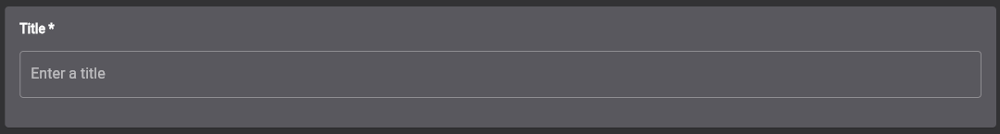

### CmsAttributBool
The `CmsAttributBool` is by default required and cant be set optional. By default the `defaultValue` is false.

Example:
```dart
CmsAttributBool(
      id: "isActive",
      displayName: "Is Article active",
      canObjectBeSortedByThisAttribut: true,
)
```
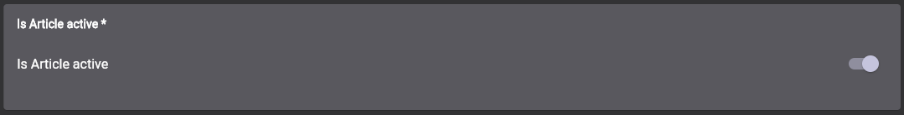

### CmsAttributInt
Example:
```dart
CmsAttributInt(
          id: "sortOrder",
          displayName: "Sort Order",
          defaultValue: 0,
          canObjectBeSortedByThisAttribut: true,
)
```
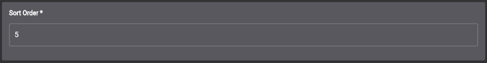

### CmsAttributDouble
Example:
```dart
CmsAttributDouble(
      id: "price",
      displayName: "Price",
      hint: "12.34",
      invalidValueErrorMessage: "You have to enter valid a price",
      canObjectBeSortedByThisAttribut: true,
      validator: CmsBaseValidator.isPrice,
)
```
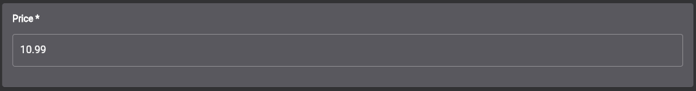

### CmsAttributColor
The color selection widget is build upon the [flutter_colorpicker](https://pub.dev/packages/flutter_colorpicker) package.

Example:
```dart
const CmsAttributColor(
        id: "color",
        displayName: "Color",
        isOptional: true,
)
```
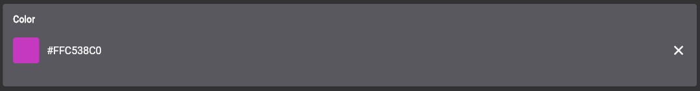


### CmsAttributDateTime
Example:
```dart
CmsAttributDateTime(
      id: "timestamp",
      displayName: "Created at",
      minDateTime: DateTime(2020),
      maxDateTime: DateTime.now().add(const Duration(days: 365)),
)
```
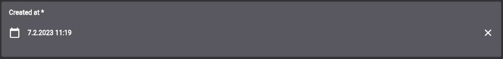

### CmsAttributDate
Example:
```dart
CmsAttributDate(
    id: "day",
    displayName: "Day",
    defaultValue: DateTime(2020, 12, 12),
)
```
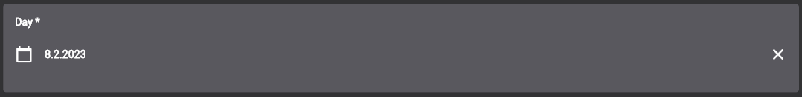

### CmsAttributTime
Example:
```dart
const CmsAttributTime(
      id: "startingTime",
      displayName: "Starting Time",
      invalidValueErrorMessage: "You have to enter starting time",
    )
```


### CmsAttributHtml
The html widget is build upon the [quill_html_editor](https://pub.dev/packages/quill_html_editor) package. Because it is an embadded web library, there could be some unwanted behavior in the UI.

Example:
```dart
const CmsAttributHtml(
        id: "content",
        displayName: "Content",
)
```
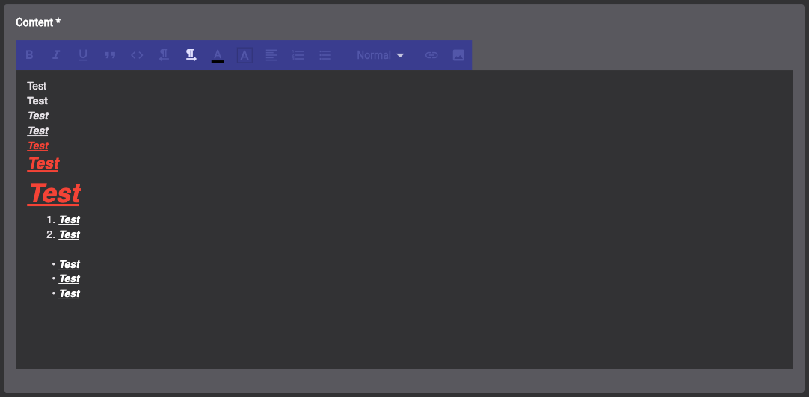

### CmsAttributImage
The image selection is build upon the [file_picker](https://pub.dev/packages/file_picker) package.

Example:
```dart
CmsAttributImage(
    id: "image",
    displayName: "Image",
    isOptional: true,
)
```


### CmsAttributFile
The file selection is build upon the [file_picker](https://pub.dev/packages/file_picker) package.

Example:
```dart
CmsAttributFile(
    id: "file",
    displayName: "File",
    isOptional: true,
)
```
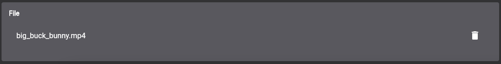

### CmsAttributLocation
Example:
```dart
CmsAttributLocation(
    id: "location",
    displayName: "Location",
    invalidValueErrorMessage: "You have to enter valid location",
)
```
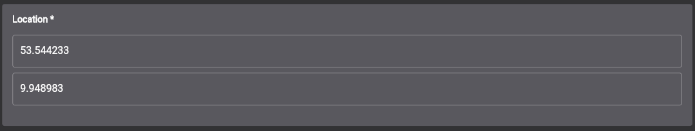

### CmsAttributSelection
The selected object could be of any type. 

Example:
```dart
CmsAttributSelection<EventType>(
    id: "eventType",
    displayName: "Typ",
    invalidValueErrorMessage: "You have to select a typ",
    options: EventType.values,
    optionToString: (option) => option.name,
)
```


### CmsAttributList
You can use `CmsAttributList`to add a list of attributes to your object. The type of the attributes will be defined by the parameter `cmsAttributStructure`. There you have to pass a `CmsAttributStructure`. You can use any `CmsAttributStructure` you want. The behaviour for adding a new attribut instance to the list will be defined in there.

Example:
```dart
CmsAttributList(
    id: "neededItems",
    displayName: "Needed Items",
    cmsAttributStructure: CmsAttributString(
        id: "item",
        displayName: "Item",
        hint: "Item",
        invalidValueErrorMessage: "You have to enter item",
    ),
)
```


### CmsAttributReference
This attribut gives you the possibility to search for an option which will be selected. You can define that function and return a list of possible items which can be selected. You also have to pass a function for the parameter `getReferenceDisplayString`. This function has to return the display string for a passed item.

A common use case is to add a reference to another object. 

Example:
```dart
CmsAttributReference<Author>(
    id: "author",
    displayName: "Author",
    searchFunction: loadAuthors,
    getReferenceDisplayString: (author) => author.name,
    isOptional: true,
)

Future<CmsResult<List<Author>>> loadAuthors(String searchQuery) async {
    final authors = [
        Author(id: 1, name: "Jan"),
        Author(id: 1, name: "Fritz"),
        Author(id: 1, name: "Janosch"),
    ];

    final filteredAuthors = authors.where((author) => author.name.startsWith(searchQuery)).toList();

    return CmsResult.success(filteredAuthors);
}
```

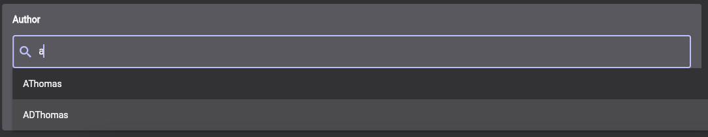


## Base Validator
Flutter CMS offers you some base validation methods that you can use inside your `CmsAttributStructure`. You can find them inside the `CmsBaseValidator` class.

## CMS Object Structure CRUD Operations
In an `CmsObjectStructure` you need to define CRUD functions which connects Flutter CMS with your backend. Every of these functions returns a Future of `CmsResult`. The `CmsResult` has two constructors `CmsResult.success` and `CmsResult.error`. If your function succeeds you can use the `CmsResult.success` constructor and pass the required data. If a function shouldnt return any data you need to pass a new `Unit` object: `CmsResult.success(Unit())`. This is for example the case in the delete function. There we only need the information if the action was successful. So you could emagine `Unit()` as `void`. If the action wasnt successful you should use the `CmsResult.error` constructor and pass an error message string. That string will be displayed to the user.

Example:

```dart
Future<CmsResult<Unit>> deleteEvent(String eventId) async {
  try {
    final response = await client.delete("/event/$eventId");

    if(response.status == 404) {
        return CmsResult.error("There exists no event with the id $eventId")
    } else {
        return CmsResult.success(const Unit());
    }
  } catch (exception) {
    return CmsResult.error("Failed to delete event. Please try again");
  }
}
```

To get and pass instances of the pre defined `CmsObjectStructure` there will be used the object `CmsObjectValue`. That object gets an `id` which is the id of the instance, not the id of the `CmsObjectStructure`. Also it has a list of `CmsAttributValue`. That list should contain a value for every `CmsAttributStructure` defined in the `CmsObjectStructure`. Its important that the `id` which is set in an `CmsAttributValue` is the same as the `id` in the defined `CmsAttributStructure` to which it belongs to. Thats neccessary to load the value of the attribute in a `CmsObjectValue` with the method `getAttributValueByAttributId`.

It is a good practice to define a seperate model for the `CmsObjectStructure` with `fromCmsObjectValue` and `toCmsObjectValue` methods. Similar to the `fromJson` and `toJson` methods. That makes it possible to work with that model in a typesave way. 

Example:
```dart
class Event {
  final String id;
  final String title;
  final double? locationLatitude;
  final double? locationLongitude;
  final TimeOfDay startingTime;

  Event({
    required this.id,
    required this.title,
    required this.locationLatitude,
    required this.locationLongitude,
    required this.startingTime,
  });

  CmsObjectValue toCmsObjectValue() {
    return CmsObjectValue(
      id: id,
      values: [
        CmsAttributValue(id: 'id', value: id),
        CmsAttributValue(id: 'title', value: title),
        CmsAttributValue(
          id: 'location',
          value: locationLatitude != null && locationLongitude != null
              ? CmsLocation(
                  latitude: locationLatitude!,
                  longitude: locationLongitude!,
                )
              : null,
        ),
        CmsAttributValue(id: 'startingTime', value: startingTime),
      ],
    );
  }

  factory Event.fromCmsObjectValue({
    required CmsObjectValue cmsObjectValue,
    String? id,
  }) {
    return Event(
      id: id ?? cmsObjectValue.id!,
      title: cmsObjectValue.getAttributValueByAttributId('title'),
      locationLatitude: (cmsObjectValue.getAttributValueByAttributId('location') as CmsLocation?)?.latitude,
      locationLongitude: (cmsObjectValue.getAttributValueByAttributId('location') as CmsLocation?)?.longitude,
      startingTime: cmsObjectValue.getAttributValueByAttributId('startingTime'),
    );
  }
}
```

### Load Cms Objects
The most complex function is `OnLoadCmsObjects`. Thats because this function also handles pagination, filtering and sorting items. 

For the pagination behavior it doesnt directly return a list of `CmsObjectValue` but an `CmsObjectValueList` object, which contains that `CmsObjectValue` list. Additionaly the `CmsObjectValueList` needs an `overallPageCount` value. This is needed to handle the pagination correctly.

The `OnLoadCmsObjects` function gets an `page` value. Thats the value of the page which should be loaded and returned from the function. The size of each page could be defined by yourself. 

The only search parameter for now is `searchQuery`. That optional parameter contains the search text which was entered by the user to filter the objects. How implement that filter is up to you.

For sort functionality an optional value of `CmsObjectSortOptions` will be passed. That object contains the attributId of the attribut according to which sorting is to take place. If the value `ascending` is set to true, the attribut should be sorted ascending, otherwise descending. The objects can only be sorted by attributes where the values `shouldBeDisplayedOnOverviewTable` and `canObjectBeSortedByThisAttribut` both where set to true. 

## Localization
TODO

## Custom Screens
TODO

## Theming
TODO
