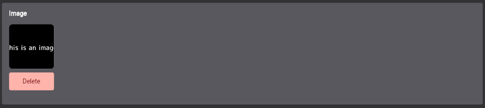

# Flat

Flat is a package that helps you set up an admin tool to create content for your backend just by defining the structure of your objects and the methods to handle the crud operations.

IMPORTANT: This package is in early stages and not very well tested so far. Use it on your own risk.

## Index

- [Setup](#setup)
- [Handle authentication](#handle-authentication)
- [Object Structures](#object-structures)
- [Flat Attribute Structure](#flat-attribute-structure)
  - [FlatAttributeString](#FlatAttributeString)
  - [FlatAttributeBool](#FlatAttributeBool)
  - [FlatAttributeInt](#FlatAttributeInt)
  - [FlatAttributeDouble](#FlatAttributeDouble)
  - [FlatAttributeColor](#FlatAttributeColor)
  - [FlatAttributeDateTime](#FlatAttributeDateTime)
  - [FlatAttributeDate](#FlatAttributeDate)
  - [FlatAttributeTime](#FlatAttributeTime)
  - [FlatAttributeImage](#FlatAttributeImage)
  - [FlatAttributeFile](#FlatAttributeFile)
  - [FlatAttributeLocation](#FlatAttributeLocation)
  - [FlatAttributeSelection](#FlatAttributeSelection)
  - [FlatAttributeList](#FlatAttributeList)
  - [FlatAttributeReference](#FlatAttributeReference)
- [Base Validator](#base-validator)
- [Flat Object Structure CRUD Operations](#flat-object-structure-crud-operations)
- [Load Flat Objects](#load-flat-objects)
- [Custom Strings](#custom-strings)
- [Custom Screens](#custom-screens)
  - [Flat Custom Menu Entry](#flat-custom-menu-entry)
  - [Flat Unauthorized Route](#flat-unauthorized-route)
- [Theming](#theming)


## Setup
To start your flat app you just have to return the `FlatApp` Widget in your `runApp` method. This will automatically setup all you need to run the app.

```dart
void main() {
  runApp(
    FlatApp(
        ...
    );
}
```

## Handle authentication
Flat is completely undependent from your used authentication method. You just have to pass a method to get the current logged in user to the `FlatAuthInfos`. If there currently is no logged in user, that method needs to return null. Based on that method Flat can check if the user is authenticated and allow/disallow specific routes.

The passed `onLogout` will be called if the user wants to logout. After this method was called, the `getLoggedInUser` method should return null. The further logout functionality and button will automatically handled.

Because there could be many different ways to login, you have to setup your login screen by yourself. This screen needs also be passed to the `FlatAuthInfos`. After you have successfully handled your login, you just have to call the given `onLoginSuccess` method. This will automatically navigate you into the Flat dashboard.

```dart
void main() {
  runApp(
    FlatApp(
        flatAuthInfos: FlatAuthInfos(
            getLoggedInUser: authService.getLoggedInUser,
            onLogout: authService.logout,
            loginScreenBuilder: (onLoginSuccess) => LoginScreen(onLoginSuccess: onLoginSuccess),
        ),
        ...
    );
}
```

You can optionally display informations about the logged in user. Therefore you need to set the `getFlatUserInfos`. That method will give you the currently logged in user which was returned by the `getLoggedInUser` method.

```dart
void main() {
  runApp(
    FlatApp(
        getFlatUserInfos: (loggedInUser) => FlatUserInfos(
            name: loggedInUser.name,
            email: loggedInUser.email,
            role: loggedInUser.prefs.data["role"] == "admin" ? "Admin" : "User",
        ),
        ...
    );
}
```

## Object Structures
The main part of Flat is the content management. You can easely display, create, update and delete objects. All Flat needs for that is the data structure of your object and the methods to handle these crud operations.

To define the data structure you have to pass a method to `getFlatObjectStructures` which returns a list of `FlatObjectStructure`. The method gives you the currently logged in user so you can change the functionality based on the logged in user. The `FlatObjectStructure` needs to have a list of attributes. Every attribute must extend the `FlatAttributeStructure`. Flat gives you a number of pre defined attributes but if you need a specific new attribute, you can define it by yourself.

Not every of crud function needs to be set. If you dont pass a specific method, that functionality will automatically be disabled. As you get the current logged in user, it is possible to disable some of these crud functions for specific user.

To get more information about the crud operations, take a look at the [Flat Object Structure CRUD Operations](#flat-object-structure-crud-operations) section.


```dart
void main() {
  runApp(
    FlatApp(
        getFlatObjectStructures: (loggedInUser) => [
            FlatObjectStructure(
                id: "event",
                displayName: "Event",
                attributes: [
                    FlatAttributeString(
                        id: "title",
                        displayName: "Title",
                        hint: "Enter a title",
                    ),
                    FlatAttributeLocation(
                        id: "location",
                        displayName: "Location",
                        invalidValueErrorMessage: "You have to enter valid location",
                    ),
                    FlatAttributeTime(
                        id: "startingTime",
                        displayName: "Starting Time",
                        isOptional: true,
                    ),
                ],
                onCreateFlatObject: createEvent,
                onUpdateFlatObject: updateEvent,
                loadFlatObjectById: loadEventById,
                onLoadFlatObjects: LoadFlatObjects.offset(loadEvents),
                onDeleteFlatObject: loggedInUser.isAdmin ? deleteEvent : null,
            ),
        ],
        ...
    );
}
```

## Flat Attribute Structure
The `id` of every `FlatAttributeStructure` inside a `FlatObjectStructure` has to be unique. Its needed to identify a `FlatAttributeValue` inside a `FlatObjectValue` which are needed in the crud functions of a `FlatObjectStructure`.
Every `FlatAttributeStructure` can be validated so that it will only be possible to pass a valid value. Just set the `validator` for that. If the user passed value is not valid the `invalidValueErrorMessage` will be displayed. So you can also handle the error message.
By default every `FlatAttributeStructure` is required. You can set the parameter `isOptional` to true if also null values should be possible. If the attribute is required and not set, the `invalidValueErrorMessage` will be displayed.
Flat has many pre defined `FlatAttributeStructure` elements. Here is a list of every existing element:

### FlatAttributeString

Example:
```dart
FlatAttributeString(
    id: "title",
    displayName: "Title",
    hint: "Enter a title",
    invalidValueErrorMessage: "You have to enter a title",
    maxLength: 15,
)
```


### FlatAttributeBool
The `FlatAttributeBool` is by default required and cant be set optional. By default the `defaultValue` is false.

Example:
```dart
FlatAttributeBool(
      id: "isActive",
      displayName: "Is Article active",
      canObjectBeSortedByThisAttribute: true,
)
```


### FlatAttributeInt
Example:
```dart
FlatAttributeInt(
          id: "sortOrder",
          displayName: "Sort Order",
          defaultValue: 0,
          canObjectBeSortedByThisAttribute: true,
)
```


### FlatAttributeDouble
Example:
```dart
FlatAttributeDouble(
      id: "price",
      displayName: "Price",
      hint: "12.34",
      invalidValueErrorMessage: "You have to enter valid a price",
      canObjectBeSortedByThisAttribute: true,
      validator: FlatBaseValidator.isPrice,
)
```


### FlatAttributeColor
The color selection widget is build upon the [flutter_colorpicker](https://pub.dev/packages/flutter_colorpicker) package.

Example:
```dart
const FlatAttributeColor(
        id: "color",
        displayName: "Color",
        isOptional: true,
)
```


### FlatAttributeDateTime
Example:
```dart
FlatAttributeDateTime(
      id: "timestamp",
      displayName: "Created at",
      minDateTime: DateTime(2020),
      maxDateTime: DateTime.now().add(const Duration(days: 365)),
)
```


### FlatAttributeDate
Example:
```dart
FlatAttributeDate(
    id: "day",
    displayName: "Day",
    defaultValue: DateTime(2020, 12, 12),
)
```


### FlatAttributeTime
Example:
```dart
const FlatAttributeTime(
      id: "startingTime",
      displayName: "Starting Time",
      invalidValueErrorMessage: "You have to enter starting time",
    )
```


### FlatAttributeImage
The image selection is build upon the [file_picker](https://pub.dev/packages/file_picker) package.

Example:
```dart
FlatAttributeImage(
    id: "image",
    displayName: "Image",
    isOptional: true,
)
```


### FlatAttributeFile
The file selection is build upon the [file_picker](https://pub.dev/packages/file_picker) package.

Example:
```dart
FlatAttributeFile(
    id: "file",
    displayName: "File",
    isOptional: true,
)
```


### FlatAttributeLocation
Example:
```dart
FlatAttributeLocation(
    id: "location",
    displayName: "Location",
    invalidValueErrorMessage: "You have to enter valid location",
)
```


### FlatAttributeSelection
The selected object could be of any type. 

Example:
```dart
FlatAttributeSelection<EventType>(
    id: "eventType",
    displayName: "Typ",
    invalidValueErrorMessage: "You have to select a typ",
    options: EventType.values,
    optionToString: (option) => option.name,
)
```


### FlatAttributeList
You can use `FlatAttributeList`to add a list of attributes to your object. The type of the attributes will be defined by the parameter `FlatAttributeStructure`. There you have to pass a `FlatAttributeStructure`. You can use any `FlatAttributeStructure` you want. The behaviour for adding a new attribute instance to the list will be defined in there.

Example:
```dart
FlatAttributeList(
    id: "neededItems",
    displayName: "Needed Items",
    FlatAttributeStructure: FlatAttributeString(
        id: "item",
        displayName: "Item",
        hint: "Item",
        invalidValueErrorMessage: "You have to enter item",
    ),
)
```


### FlatAttributeReference
This attribute gives you the possibility to search for an option which will be selected. You can define that function and return a list of possible items which can be selected. You also have to pass a function for the parameter `getReferenceDisplayString`. This function has to return the display string for a passed item.

A common use case is to add a reference to another object. 

Example:
```dart
FlatAttributeReference<Author>(
    id: "author",
    displayName: "Author",
    searchFunction: loadAuthors,
    getReferenceDisplayString: (author) => author.name,
    isOptional: true,
)

Future<FlatResult<List<Author>>> loadAuthors(String searchQuery) async {
    final authors = [
        Author(id: 1, name: "Jan"),
        Author(id: 1, name: "Fritz"),
        Author(id: 1, name: "Janosch"),
    ];

    final filteredAuthors = authors.where((author) => author.name.startsWith(searchQuery)).toList();

    return FlatResult.success(filteredAuthors);
}
```


## Base Validator
Flat offers you some base validation methods that you can use inside your `FlatAttributeStructure`. You can find them inside the `FlatBaseValidator` class.

## Flat Object Structure CRUD Operations
In an `FlatObjectStructure` you need to define CRUD functions which connects Flat with your backend. Every of these functions returns a Future of `FlatResult`. The `FlatResult` has two constructors `FlatResult.success` and `FlatResult.error`. If your function succeeds you can use the `FlatResult.success` constructor and pass the required data. If a function shouldnt return any data you need to pass a new `Unit` object: `FlatResult.success(Unit())`. This is for example the case in the delete function. There we only need the information if the action was successful. So you could emagine `Unit()` as `void`. If the action wasnt successful you should use the `FlatResult.error` constructor and pass an error message string. That string will be displayed to the user.

Example:

```dart
Future<FlatResult<Unit>> deleteEvent(String eventId) async {
  try {
    final response = await client.delete("/event/$eventId");

    if(response.status == 404) {
        return FlatResult.error("There exists no event with the id $eventId")
    } else {
        return FlatResult.success(const Unit());
    }
  } catch (exception) {
    return FlatResult.error("Failed to delete event. Please try again");
  }
}
```

To get and pass instances of the pre defined `FlatObjectStructure` there will be used the object `FlatObjectValue`. That object gets an `id` which is the id of the instance, not the id of the `FlatObjectStructure`. Also it has a list of `FlatAttributeValue`. That list should contain a value for every `FlatAttributeStructure` defined in the `FlatObjectStructure`. Its important that the `id` which is set in an `FlatAttributeValue` is the same as the `id` in the defined `FlatAttributeStructure` to which it belongs to. Thats neccessary to load the value of the attribute in a `FlatObjectValue` with the method `getAttributeValueByAttributeId`.

It is a good practice to define a seperate model for the `FlatObjectStructure` with `fromFlatObjectValue` and `toFlatObjectValue` methods. Similar to the `fromJson` and `toJson` methods. That makes it possible to work with that model in a typesave way. 

Example:
```dart
class Event {
  final String id;
  final String title;
  final double? locationLatitude;
  final double? locationLongitude;
  final TimeOfDay startingTime;

  Event({
    required this.id,
    required this.title,
    required this.locationLatitude,
    required this.locationLongitude,
    required this.startingTime,
  });

  FlatObjectValue toFlatObjectValue() {
    return FlatObjectValue(
      id: id,
      values: [
        FlatAttributeValue(id: 'id', value: id),
        FlatAttributeValue(id: 'title', value: title),
        FlatAttributeValue(
          id: 'location',
          value: locationLatitude != null && locationLongitude != null
              ? FlatLocation(
                  latitude: locationLatitude!,
                  longitude: locationLongitude!,
                )
              : null,
        ),
        FlatAttributeValue(id: 'startingTime', value: startingTime),
      ],
    );
  }

  factory Event.fromFlatObjectValue({
    required FlatObjectValue flatObjectValue,
    String? id,
  }) {
    return Event(
      id: id ?? flatObjectValue.id!,
      title: flatObjectValue.getAttributeValueByAttributeId('title'),
      locationLatitude: (flatObjectValue.getAttributeValueByAttributeId('location') as FlatLocation?)?.latitude,
      locationLongitude: (flatObjectValue.getAttributeValueByAttributeId('location') as FlatLocation?)?.longitude,
      startingTime: flatObjectValue.getAttributeValueByAttributeId('startingTime'),
    );
  }
}
```

### Load Flat Objects
The most complex function is `OnLoadFlatObjects`. Thats because this function also handles pagination, filtering and sorting items. 

For the pagination there are two methods available. You can load your data with offset- or with curser-pagination. 

To use the offset-pagination you have to use the `LoadFlatObjects.offset` constructor to pass the `OnLoadFlatObjectsOffset` function. 

To use the curser-pagination you have to use the `LoadFlatObjects.curser` constructor and pass the `OnLoadFlatObjectsCurser` function. This method doesnt directly return a list of `FlatObjectValue` but an `FlatOffsetObjectValueList` object, which contains that `FlatObjectValue` list. Additionaly the `FlatOffsetObjectValueList` needs an `overallPageCount` value. This is needed to handle the pagination correctly. 
The `OnLoadFlatObjectsCurser` function gets an `page` value. Thats the value of the page which should be loaded and returned from the function. The size of each page could be defined by yourself. 

The only search parameter for now is `searchQuery`. That optional parameter contains the search text which was entered by the user to filter the objects. How implement that filter is up to you.

For sort functionality an optional value of `FlatObjectSortOptions` will be passed. That object contains the attributeId of the attribute according to which sorting is to take place. If the value `ascending` is set to true, the attribute should be sorted ascending, otherwise descending. The objects can only be sorted by attributes where the values `shouldBeDisplayedOnOverviewTable` and `canObjectBeSortedByThisAttribute` both where set to true. 

## Custom Strings
You can override every string which is used in Flat. To do that you need to pass a `FlatTexts` object to the `FlatApp`. That object contains all strings which are used in Flat. You can find the default strings in the constructor of the `FlatTexts` class.

## Custom Screens
You can define two kinds of custom screens. One is a custom menu entry which is displayed in the main menu and the other one is a public screen which can be reached before the user is logged in.
 
### Flat Custom Menu Entry
To define custom menu entries you need to pass a list of `FlatCustomMenuEntry` to the `FlatApp`. The `id` of a `FlatCustomMenuEntry` will be used for navigation and will be shown in the url. The `displayName` will be visible in the menu and the `contentBuilder` has to return the widget which should be shown if the menu entry is selected.

These menu entries can only be reached if the user is logged in. So it is possible to display content there based on the logged in user.

### Flat Unauthorized Route
A `FlatUnauthorizedRoute` is a route which can be reached before the user logged in. You can pass a list of `FlatUnauthorizedRoute` to the `FlatApp` to define these routes. As Flat uses GoRouter for navigation you can reach your passed routes simply by using the GoRouter and navigate with it to your passed `path`. You also have to pass a `pageBuilder` to the `FlatUnauthorizedRoute`. This is the same pageBuilder you would pass to the `GoRouter`. So it is also possible to work with parameters. It is not possible to navigate to these routes if the user is logged in. Examples for using these routes could be a registration or a forgot password screen.

## Theming
To customize the look and feel of Flat you can use just pass your own `lightTheme`and `darkTheme` to `FlatApp`. The mainly used colors are `background`, `surface` and `primary`. So you can get a good result by just changing these colors.
